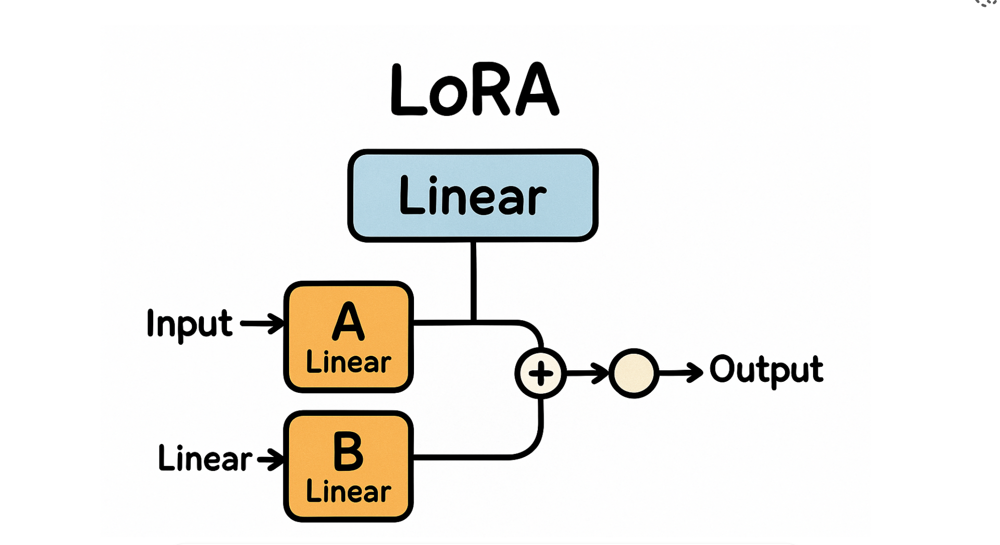

## MiniMind模型核心：
### MoE 混合专家模块

``` Python
class FeedForward(nn.Module):
    def __init__(self, config: LMConfig):
        super().__init__()
        if config.hidden_dim is None:
            hidden_dim = 4 * config.dim
            hidden_dim = int(2 * hidden_dim / 3)
            config.hidden_dim = config.multiple_of * ((hidden_dim + config.multiple_of - 1) // config.multiple_of)
        self.w1 = nn.Linear(config.dim, config.hidden_dim, bias=False)
        self.w2 = nn.Linear(config.hidden_dim, config.dim, bias=False)
        self.w3 = nn.Linear(config.dim, config.hidden_dim, bias=False)
        self.dropout = nn.Dropout(config.dropout)

    def forward(self, x):
        return self.dropout(self.w2(F.silu(self.w1(x)) * self.w3(x)))


class MoEGate(nn.Module):
    def __init__(self, config: LMConfig):
        super().__init__()
        self.config = config
        self.top_k = config.num_experts_per_tok
        self.n_routed_experts = config.n_routed_experts

        self.scoring_func = config.scoring_func
        self.alpha = config.aux_loss_alpha
        self.seq_aux = config.seq_aux

        self.norm_topk_prob = config.norm_topk_prob
        self.gating_dim = config.dim
        self.weight = nn.Parameter(torch.empty((self.n_routed_experts, self.gating_dim)))
        self.reset_parameters()

    def reset_parameters(self) -> None:
        import torch.nn.init as init
        init.kaiming_uniform_(self.weight, a=math.sqrt(5))

    def forward(self, hidden_states):
        bsz, seq_len, h = hidden_states.shape
        hidden_states = hidden_states.view(-1, h)
        logits = F.linear(hidden_states, self.weight, None)
        if self.scoring_func == 'softmax':
            scores = logits.softmax(dim=-1)
        else:
            raise NotImplementedError(f'insupportable scoring function for MoE gating: {self.scoring_func}')

        topk_weight, topk_idx = torch.topk(scores, k=self.top_k, dim=-1, sorted=False)

        if self.top_k > 1 and self.norm_topk_prob:
            denominator = topk_weight.sum(dim=-1, keepdim=True) + 1e-20
            topk_weight = topk_weight / denominator

        if self.training and self.alpha > 0.0:
            scores_for_aux = scores
            aux_topk = self.top_k
            topk_idx_for_aux_loss = topk_idx.view(bsz, -1)
            if self.seq_aux:
                scores_for_seq_aux = scores_for_aux.view(bsz, seq_len, -1)
                ce = torch.zeros(bsz, self.n_routed_experts, device=hidden_states.device)
                ce.scatter_add_(1, topk_idx_for_aux_loss,
                                torch.ones(bsz, seq_len * aux_topk, device=hidden_states.device)).div_(
                    seq_len * aux_topk / self.n_routed_experts)
                aux_loss = (ce * scores_for_seq_aux.mean(dim=1)).sum(dim=1).mean() * self.alpha
            else:
                mask_ce = F.one_hot(topk_idx_for_aux_loss.view(-1), num_classes=self.n_routed_experts)
                ce = mask_ce.float().mean(0)
                Pi = scores_for_aux.mean(0)
                fi = ce * self.n_routed_experts
                aux_loss = (Pi * fi).sum() * self.alpha
        else:
            aux_loss = 0
        return topk_idx, topk_weight, aux_loss


class MOEFeedForward(nn.Module):
    def __init__(self, config: LMConfig):
        super().__init__()
        self.config = config
        self.experts = nn.ModuleList([
            FeedForward(config)
            for _ in range(config.n_routed_experts)
        ])
        self.gate = MoEGate(config)
        if config.n_shared_experts is not None:
            self.shared_experts = FeedForward(config)

    def forward(self, x):
        identity = x
        orig_shape = x.shape
        bsz, seq_len, _ = x.shape
        # 使用门控机制选择专家
        topk_idx, topk_weight, aux_loss = self.gate(x)
        x = x.view(-1, x.shape[-1])
        flat_topk_idx = topk_idx.view(-1)
        if self.training:
            x = x.repeat_interleave(self.config.num_experts_per_tok, dim=0)
            y = torch.empty_like(x, dtype=torch.float16)
            for i, expert in enumerate(self.experts):
                y[flat_topk_idx == i] = expert(x[flat_topk_idx == i]).to(y.dtype)  # 确保类型一致
            y = (y.view(*topk_weight.shape, -1) * topk_weight.unsqueeze(-1)).sum(dim=1)
            y = y.view(*orig_shape)
        else:
            y = self.moe_infer(x, flat_topk_idx, topk_weight.view(-1, 1)).view(*orig_shape)
        if self.config.n_shared_experts is not None:
            y = y + self.shared_experts(identity)
        self.aux_loss = aux_loss
        return y

    @torch.no_grad()
    def moe_infer(self, x, flat_expert_indices, flat_expert_weights):
        expert_cache = torch.zeros_like(x)
        idxs = flat_expert_indices.argsort()
        tokens_per_expert = flat_expert_indices.bincount().cpu().numpy().cumsum(0)
        token_idxs = idxs // self.config.num_experts_per_tok
        # 当tokens_per_expert = [6, 15, 20, 26]，tokens_per_expert.shape[0]即为专家数量（此时为4）
        # 且token_idxs = [3, 7, 19, 21, 24, 25,  4,  5,  6, 10, 11, 12...] 时
        # 意味token_idxs[:6] -> [3, 7, 19, 21, 24, 25]这6个位置属于专家0处理的token（每个token有可能被多个专家处理，这取决于num_experts_per_tok）
        # 接下来9个位置token_idxs[6:15] -> [4,  5,  6, 10, 11, 12...]属于专家1处理的token...依此类推
        for i, end_idx in enumerate(tokens_per_expert):
            start_idx = 0 if i == 0 else tokens_per_expert[i - 1]
            if start_idx == end_idx:
                continue
            expert = self.experts[i]
            exp_token_idx = token_idxs[start_idx:end_idx]
            expert_tokens = x[exp_token_idx]
            expert_out = expert(expert_tokens).to(expert_cache.dtype)
            expert_out.mul_(flat_expert_weights[idxs[start_idx:end_idx]])
            expert_cache.scatter_add_(0, exp_token_idx.view(-1, 1).repeat(1, x.shape[-1]), expert_out)

        return expert_cache

```


### LoRA
```python
class LoRA(nn.Module):
    def __init__(self, in_features, out_features, rank):
        super().__init__()
        self.rank = rank  # LoRA的秩（rank），控制低秩矩阵的大小
        self.A = nn.Linear(in_features, rank, bias=False)  # 低秩矩阵A
        self.B = nn.Linear(rank, out_features, bias=False)  # 低秩矩阵B
        # 矩阵A高斯初始化
        self.A.weight.data.normal_(mean=0.0, std=0.02)
        # 矩阵B全0初始化
        self.B.weight.data.zero_()

    def forward(self, x):
        return self.B(self.A(x))


def apply_lora(model, rank=16):
    for name, module in model.named_modules():
        if isinstance(module, nn.Linear) and module.weight.shape[0] == module.weight.shape[1]:
            lora = LoRA(module.weight.shape[0], module.weight.shape[1], rank=rank).to(model.device)
            setattr(module, "lora", lora)
            original_forward = module.forward

            # 显式绑定
            def forward_with_lora(x, layer1=original_forward, layer2=lora):
                return layer1(x) + layer2(x)

            module.forward = forward_with_lora


def load_lora(model, path):
    state_dict = torch.load(path, map_location=model.device)
    for name, module in model.named_modules():
        if hasattr(module, 'lora'):
            lora_state = {k.replace(f'{name}.lora.', ''): v for k, v in state_dict.items() if f'{name}.lora.' in k}
            module.lora.load_state_dict(lora_state)


def save_lora(model, path):
    state_dict = {}
    for name, module in model.named_modules():
        if hasattr(module, 'lora'):
            lora_state = {f'{name}.lora.{k}': v for k, v in module.lora.state_dict().items()}
            state_dict.update(lora_state)
    torch.save(state_dict, path)
```

