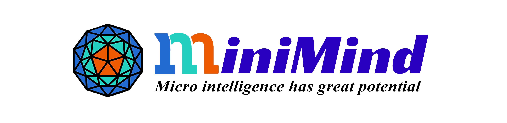
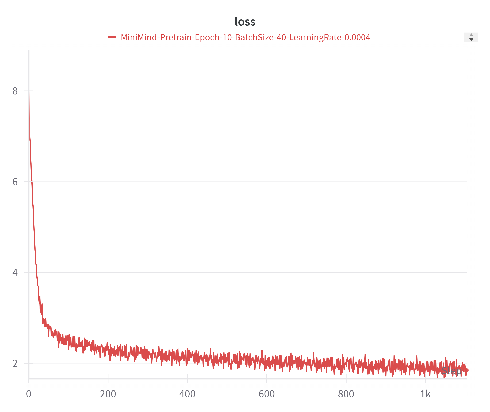
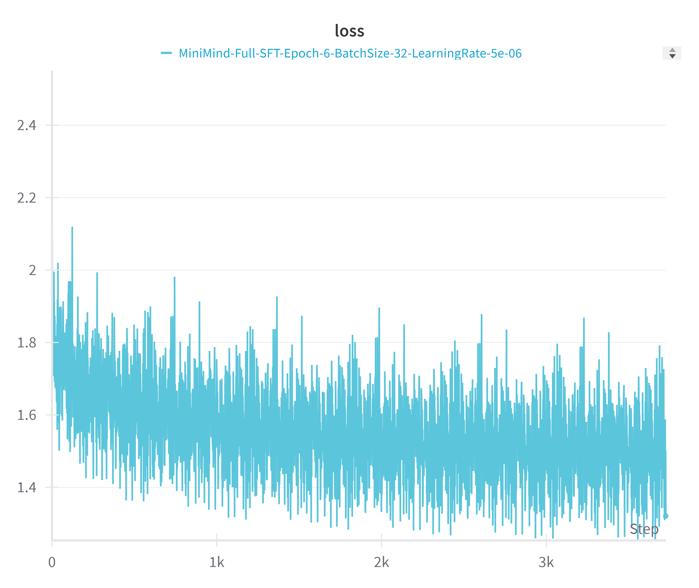

# ✨ MiniMind Reproduction Project ✨

 <!-- Or choose logo2.png -->

Welcome to my MiniMind reproduction journey! 👋 This project is my exciting first dive into the world of training Large Language Models (LLMs). As a deep learning enthusiast stepping into the LLM space for the first time, this has been an incredible learning experience, full of challenges and breakthroughs. 🚀

## 🌱 My Learning Adventure

This project isn't just about replicating MiniMind; it's a testament to the learning process. Starting with limited prior experience in LLM training, I embarked on this adventure to understand the nuts and bolts of building and refining these powerful models. Every script written, every hyperparameter tuned, and every bug squashed has been a valuable lesson. 🧠💡

 <!-- Fun GIF! -->

## 🛠️ Training Techniques Explored

Throughout this project, I experimented with various LLM training methodologies. Here's a glimpse of the techniques I've implemented and learned about:

1.  **Pre-training (`train_pretrain.py`)**: Building the foundational knowledge of the model from scratch (or continuing pre-training) on a large dataset.
    *    <!-- Example loss curve -->
2.  **Full Supervised Fine-Tuning (SFT) (`train_full_sft.py`)**: Adapting the entire pre-trained model to specific downstream tasks using labeled data.
    *    <!-- Example loss curve -->
3.  **Parameter-Efficient Fine-Tuning (PEFT) with LoRA (`train_lora.py`)**: Efficiently adapting the model by training only a small subset of parameters (Low-Rank Adaptation). This is great for resource-constrained environments!
4.  **Direct Preference Optimization (DPO) (`train_dpo.py`)**: Aligning the model with human preferences by directly optimizing a policy using preference data, often simpler than traditional RLHF.
5.  **Knowledge Distillation (`train_distillation.py`, `train_distill_reason.py`)**: Training a smaller "student" model to mimic the behavior of a larger "teacher" model, aiming for comparable performance with reduced size.

 <!-- Or LLM-structure-moe.png -->

## 🚀 Enthusiasm & Future Steps

This journey has been incredibly rewarding! Tackling the complexities of LLM training head-on has ignited a passion for this field. While this reproduction marks a significant milestone, it's just the beginning. There's so much more to explore, from different architectures and datasets to advanced alignment techniques.

If you're also a learner venturing into LLMs, I hope this project inspires you. Don't be afraid to start small, experiment, break things, and learn from every step. The world of AI is vast and exciting – let's keep learning and building together! 💪🌟

 <!-- Inspiring image -->

---

*This README reflects my personal learning journey and understanding as of [Date - e.g., April 2025].*
